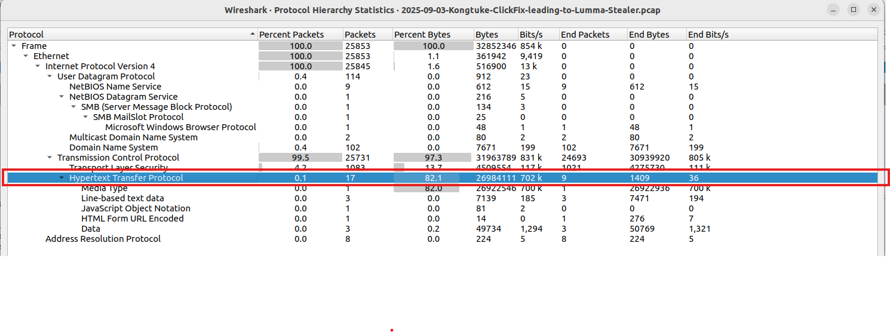
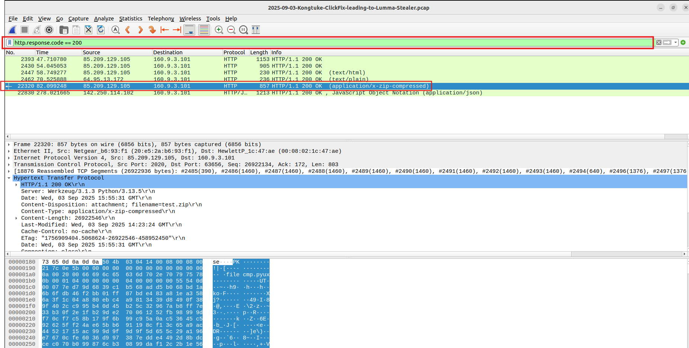
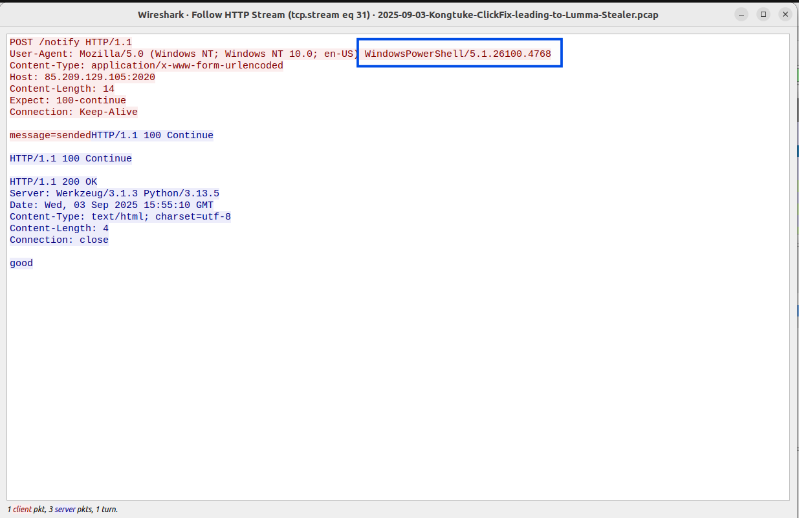
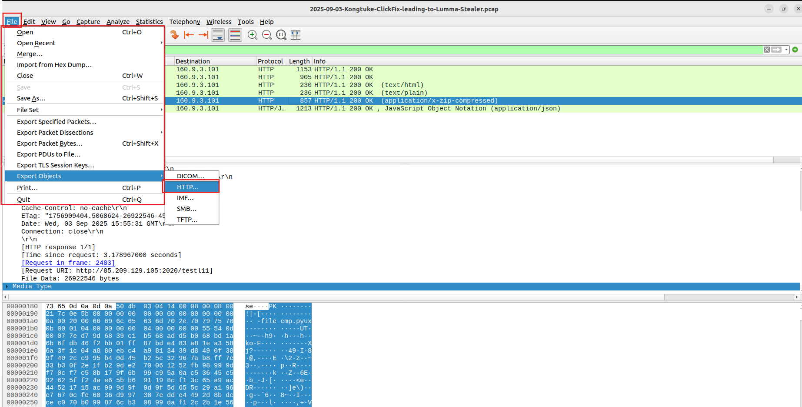
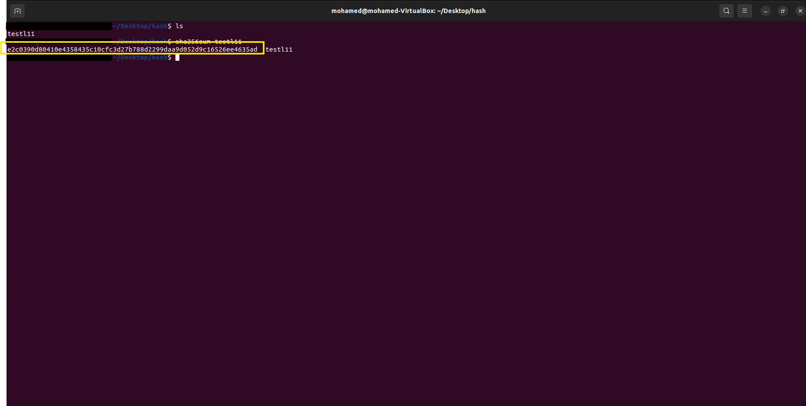
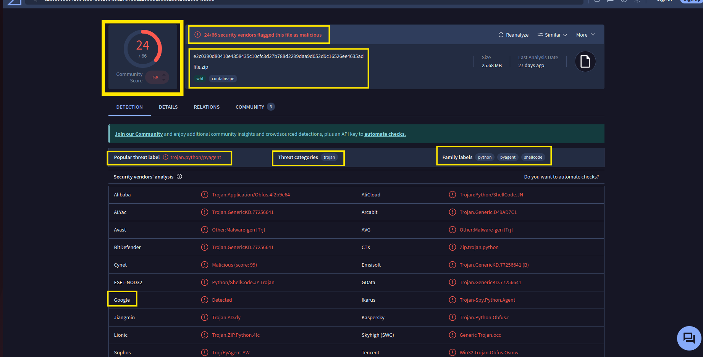
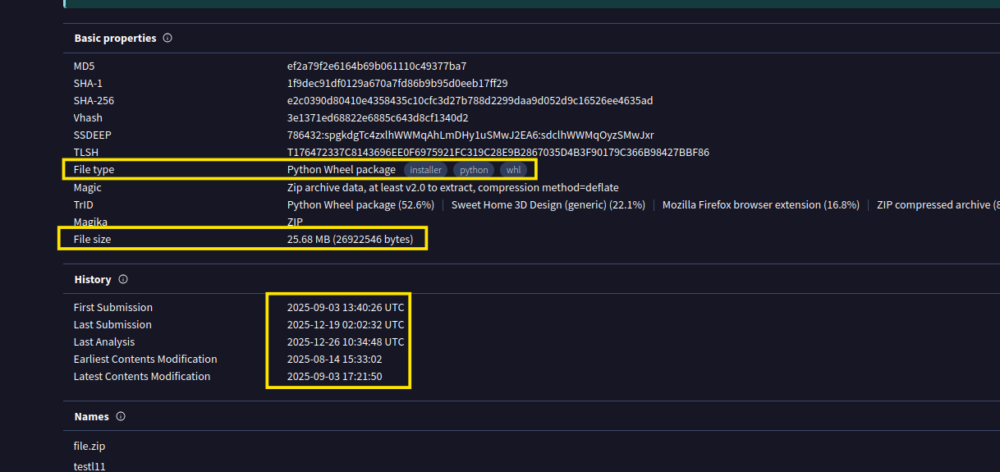

# Lumma Stealer Analysis: Network Traffic Investigation

## Executive Summary
This project details a forensic investigation into a **Lumma Stealer** malware infection on host `160.9.3.101`. I traced the full attack lifecycle, from initial DNS beaconing and PowerShell-based delivery to the final exfiltration of sensitive system metadata to a Command and Control (C2) server.

---

## Technical Methodology
I conducted this analysis using a structured forensic methodology to maintain data integrity and evidentiary clarity:

1. **Traffic Baselining (Isolate)**: I used Wireshark display filters to isolate the victim host and identify volume-based outliers.
2. **Delivery Analysis (Identify)**: I traced the infection vector to a malicious ZIP archive delivery via HTTP on non-standard port 2020.
3. **Behavioral Analysis (Analyze)**: I reconstructed HTTP streams to identify automated **WindowsPowerShell** execution and C2 dialogue.
4. **Payload Extraction (Extract)**: I utilized Wireshark’s Export Objects feature to retrieve the malicious payload for static analysis.
5. **Threat Verification (Verify)**: I calculated SHA-256 hashes and cross-referenced global threat intelligence (VirusTotal) to confirm the Lumma Stealer strain.

---

## 1. Discovery & Scoping
Statistical analysis identified a major outlier: host `160.9.3.101` exchanged **28 MB** of data with a single external endpoint.

*Figure 1: Identifying the primary threat actor via high-volume IPv4 conversations.*

*Figure 2: Protocol hierarchy showing that 82.1% of traffic was high-risk HTTP media.*

I isolated the victim's traffic and removed network "noise" to focus on the infection window.

*Figure 3: Scoping the investigation to host 160.9.3.101.*

*Figure 4: Advanced filtering to remove background ARP, ICMP, and NTP traffic.*

---

## 2. The Infection Chain (DNS & Delivery)
DNS telemetry identified automated beaconing to multiple suspicious subdomains immediately preceding the payload delivery.

*Figure 5: Identifying the initial "Patient Zero" DNS lookups.*

The malware was delivered via an obfuscated HTTP GET request on port 2020.

*Figure 6: Spotting the malicious payload request to the delivery server.*

---

## 3. Behavioral Analysis (The "Smoking Gun")
Despite the obfuscated file name, the HTTP metadata confirmed the delivery of a compressed archive.

*Figure 7: Forensic verification of the 'application/x-zip-compressed' content type.*

Reconstruction of the C2 check-in dialogue proved that the requests were initiated by **WindowsPowerShell**, confirming automated script execution.

*Figure 8: Identifying script-based C2 beaconing and the server's 'good' response.*

---

## 4. Forensic Verification
I extracted the malicious object directly from the packet stream for static analysis.

*Figure 9: Utilizing 'Export Objects' to collect the malware payload.*

I generated a SHA-256 hash in a sandboxed Ubuntu environment to establish a unique digital fingerprint for the payload.

*Figure 10: Generating the SHA-256 forensic hash in the terminal.*

Cross-referencing this hash with VirusTotal provided objective, third-party confirmation of the threat.

*Figure 11: Global threat intelligence identifying the file as Lumma Stealer.*

*Figure 12: Static analysis of the payload's history and internal properties.*

---

## Indicators of Compromise (IOCs)
| Type | Value |
| :--- | :--- |
| **Malicious IP** | `85.209.129.105` |
| **C2/Exfil IP** | `104.16.231.132` |
| **SHA-256 Hash** | `e2c0390d80410e4358435c10cfc3d27b788d2299daa9d052d9c16526ee4635ad` |
| **User-Agent** | `WindowsPowerShell/5.1` |

[Download Full Forensic Incident Report (PDF)](./reports/Analysis_of_Lum_a_Stealer_Infection.pdf)
